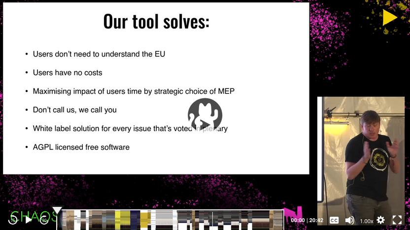

# ☎️ DearMEP

> **Empowering citizens to directly and easily reach out to their Members of the European Parliament (MEPs), amplifying public voices in critical legislative debates.**

---

## 🚀 Overview

Many impactful decisions are made in Brussels and Strasbourg, yet these processes often feel distant to citizens. **DearMEP** bridges that gap by enabling citizens and NGOs to efficiently connect with MEPs — without needing to navigate the complexities of EU politics or hunt for contact information.

### How It Works

DearMEP is embedded as a widget within campaign pages to make it **incredibly simple** for citizens to contact their representatives.

1. **Contact Suggestion**: Upon visiting a campaign page, the DearMEP widget automatically selects an MEP from your country who is most likely to be persuaded. Users can change this selection if desired.

2. **Direct Calling**: With one click, you can start a call. Your phone will ring, connecting you to an MEP at no cost. DearMEP provides suggested talking points for your conversation.

3. **Feedback Loop**: After calls, users can provide feedback on their interactions, which helps refine future contact recommendations dynamically.

For those who prefer not to call, other contact options (e.g., email addresses, social media links) are available. Users still benefit from the smart MEP selection even in these cases.

[**Learn more on our website**](https://dearmep.eu) 🌍

---

## 📸 Demo

> Watch DearMEP in action: [Conference Talk & Demo](https://dearmep.eu/concept/)

Try the live instance [here](https://dearmep.eu/showcase/chatcontrol/) (Note: This link directs to the live instance from the Chat Control campaign).

---

## ✨ Key Features

- **Instant Calling**: Connect with an MEP with just one click.
- **Call Scheduling**: Power users can schedule recurring calls.
- **Smart MEP Selection**: Focuses contact efforts on the most persuadable MEPs based on voting history and user feedback.
- **No Expertise Required**: No need to understand EU procedures or search for contact details.
- **Multi-Language Support**: Detects your browser’s language and adjusts automatically. Manual language selection is also available.
- **Strong Privacy Focus**: We take privacy very seriously. We tried to minimize data processing following privacy-by-design and privacy-by-default principles.
- **Seamless Integration**: Easily embed DearMEP as a widget into any campaign website, with customizable themes.
- **Reusable & Open Source**: Adaptable for any EU campaign.

---

## 🛠️ Getting Started

DearMEP is a white-label solution that can be tailored for any EU legislative issue. **NGOs and activists** can deploy this tool to mobilize communities and influence parliamentary decisions.

### Using an Existing Instance

To add DearMEP to your campaign page using an existing instance, simply copy a few lines of HTML. First, ask the instance administrator to add your campaign site’s URL to the allowed origins on the DearMEP server. Then, paste the HTML snippet into your page.

More details can be found [here](./client/README.md).

### Setting Up a New Instance

Setting up a new instance requires additional steps, including configuring the server and preparing a list of MEPs. This repository includes example configurations and scripts to simplify the process. Additionally, you’ll need an account with [46Elks](https://46elks.com/), which serves as the calling provider.

Further setup instructions are available [here](./server/README.md).

---

## 🛡️ License

This project is licensed under the **AGPL License**. See the [LICENSE](LICENSE) file for details.

---

## 👥 Meet the Team
To learn more about the people behind this project, visit our [team page](https://dearmep.eu/team/).
