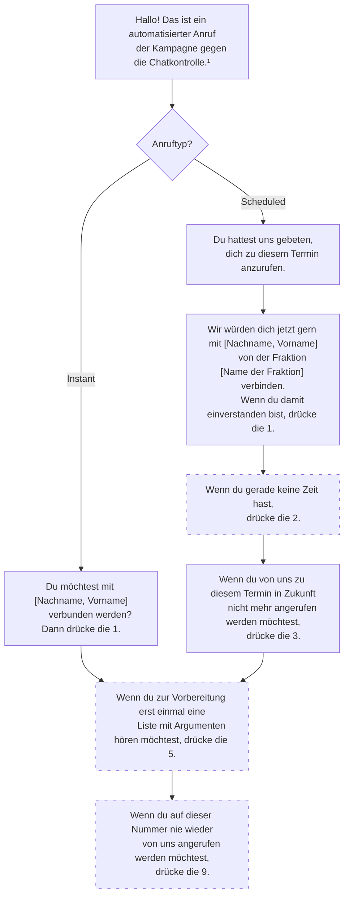
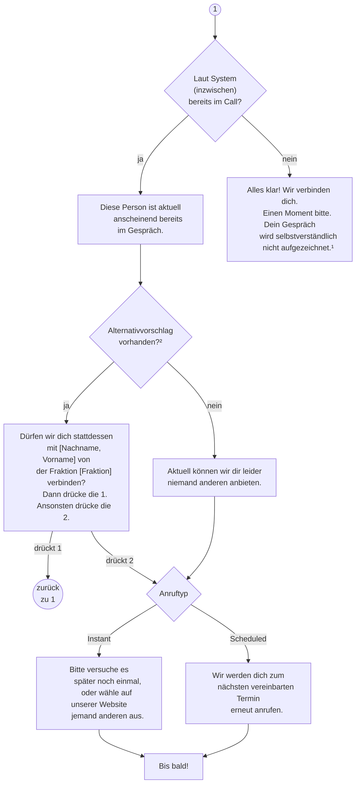
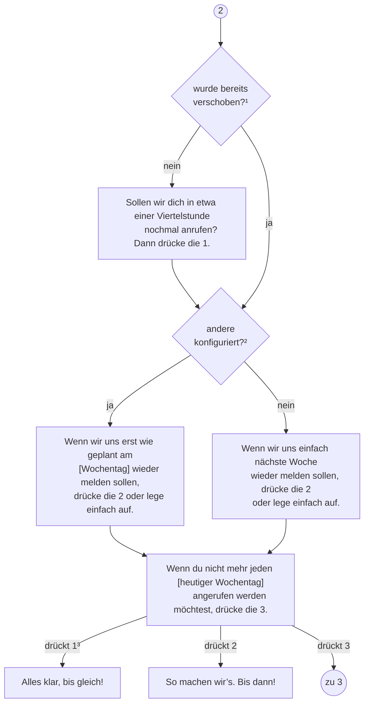
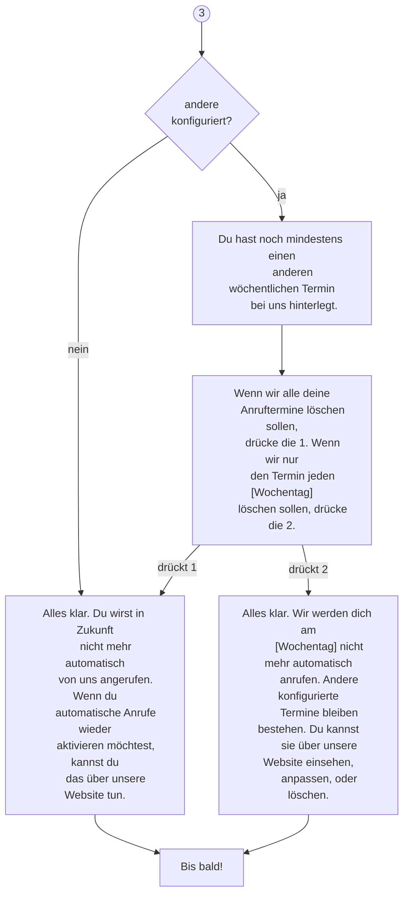
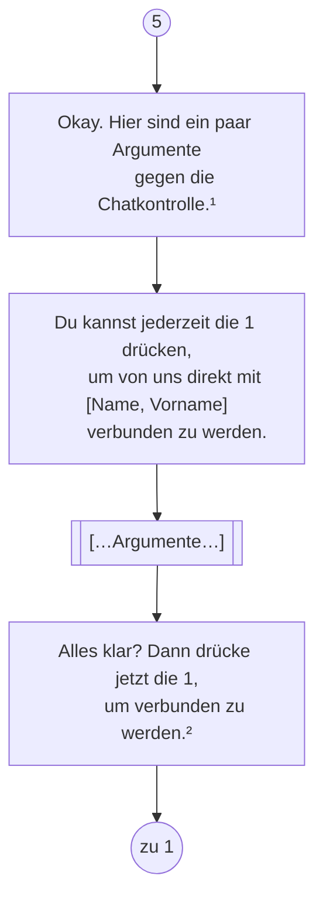
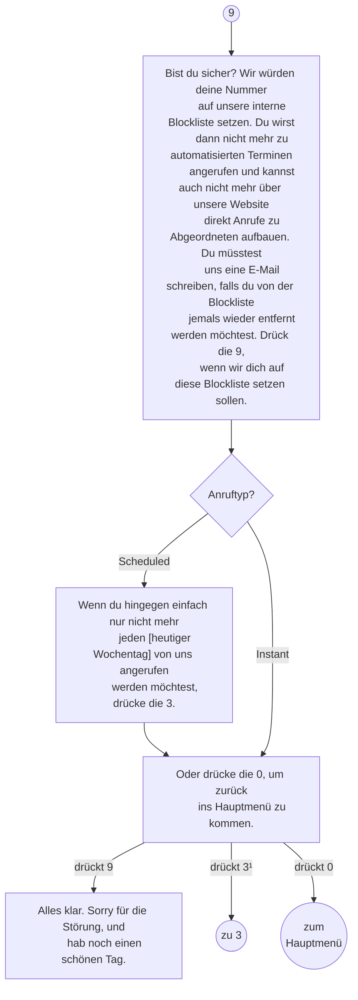

# IVR

Dieses Dokument skizziert die möglichen Optionen des Sprachmenüs am Telefon.
Der Fokus liegt darauf, alle erforderlichen Messages zusammenzutragen, damit diese übersetzt & eingesprochen werden können.
Es handelt sich hier explizit _nicht_ um eine vollständig ausgearbeitete technische Spezifikation zur Implementierung.
Allerdings sind auch die meisten technischen Aspekte schon berücksichtigt, z.B. in Fußnoten.

**Achtung – minimal veraltet:**
Auf Basis dieses Dokumentes wurde eine CSV-Datei mit allen hier enthaltenen Texten verfasst, [`messages.csv`](ivr/messages.csv).
Diese Datei wurde außerdem um einige wenige zusätzliche Texte erweitert, die hier nicht aufgeführt sind.
**Maßgeblich ist die CSV-Datei.**
Mittels [`compile_messages.py`](ivr/compile_messages.py) können außerdem eine abgeleitete CSV-Datei, die zusätzlich die Talking Points aus der `example-config.yaml` enthält, sowie eine Excel-Datei mit dem gleichen Inhalt, erstellt werden.

Um möglichst frei formulieren zu können, wurde dieses Dokument in der Muttersprache des Autors verfasst.
Es soll noch übersetzt werden, sobald Einigkeit über die Texte besteht.

Gestrichelte Schritte stellen optionale Features dar, die nicht zwingend von Anfang an implementiert werden müssen.
Es ist allerdings sinnvoll, die entsprechenden Texte schon mit aufzuzeichnen, damit wir nicht die Sprecher\*innen später um einzelne Sätze bitten müssen.

Dargestellt ist das Hauptmenü sowie die erste Ebene.
Unterebenen, sofern vorhanden, haben kein eigenes Flowchart bekommen.

Die Zifferntasten für die Auswahl der Menüpunkte können natürlich jederzeit gedrückt werden, nicht erst wenn alle Ansagen abgespielt wurden.

Die Kästen geben einen groben Vorschlag dazu, in wie viele Audiodateien die Texte auseinandergeschnitten werden sollten.
Beispielsweise ist es sinnvoll, jede Auswahloption als eine gesonderte Datei vorzuhalten.

Der Übersichtlichkeit halber gibt es aber keine extra Kästen für Prompts, die auseinander geschnitten werden müssen, um dynamische Komponenten einzubinden.
Beispielsweise sind „Du möchtest mit [Nachname, Vorname] verbunden werden?“ zwei Dateien:
Der Teil vor dem Namen der Person, und dem Teil danach.

Zusätzlich zu den Texten in den Kästen brauchen wir als Audio

* die Wochentage (Montag, Dienstag, Mittwoch, Donnerstag, Freitag, Samstag, Sonntag)
* die Namen aller 8 Fraktionen:
  * Europäische Volkspartei (Christdemokraten)
  * Progressive Allianz der Sozialdemokraten
  * Renew Europe (Liberale)
  * Die Grünen / Europäische Freie Allianz
  * Europäische Konservative und Reformer
  * Identität und Demokratie
  * Die Linke im Europäischen Parlament
  * fraktionslos

_Wie oben vermerkt finden sich in der maßgeblichen Datei mit Textfragmenten, [`messages.csv`](ivr/messages.csv), ein paar weitere Texte._

Sprecher\*innen sollten folgende Hinweise beachten:

* Aufnahmen in 44,1 kHz 16 bit oder höher, in mono
* Audio nach der Aufzeichnung normalisieren
* Anlieferung der Dateien in unkomprimierter oder verlustfrei komprimierter Fassung, also z.B. als WAV oder FLAC
* die einzelnen Fragmente als einzelne Dateien anliefern, aber auch bitte als ungeschnittene Gesamtdatei (falls wir selbst noch Schnittarbeiten vornehmen möchten)
* Dateien bitte nicht in das Repository committen, da sie zu viel Platz brauchen; ein Nextcloud-Uploadordner kann bei Bedarf gestellt werden
* als Dateinamen für die geschnittenen Dateien bitte die „ID“ aus der Liste der Texte (CSV oder Excel) verwenden

## Hauptmenü

* ¹ Vielleicht gibt’s nen besseren Namen. Würde den Namen aber instanzweit halten, sprich unterschiedliche Texte je nach einbettender Website gibt’s nicht.

## 1: Verbinden

* ¹ Expliziter Hinweis, weil IVR-eingeleitete Gespräche häufig aufgezeichnet werden.
* ² Dieser Check wird maximal 2× im Gespräch ausgeführt. Beim dritten Mal schlägt er automatisch fehl, damit die Userin nicht ewig in einer Schleife hängt.

## 2: keine Zeit

* ¹ Damit der Anruf nicht ewig „gesnoozed“ werden kann und wir dieselbe Userin alle 15 Minuten anrufen, ist diese Funktion auf einmaliges Verschieben begrenzt.
* ² Das Prompt ändert sich, je nachdem, ob noch andere Termine gescheduled sind. Die Funktionalität bleibt dieselbe: Der Anruf wird einfach beendet und zum nächsten Termin wieder angerufen. Einfach aufzulegen statt die 2 zu drücken hätte denselben Effekt.
* ³ Nur verfügbar, wenn nicht schon einmal verschoben wurde.

## 3: Termin löschen

## 5: Argumente

* ¹ Dieser Text sollte von der jeweiligen Instanz angepasst werden, genauso wie die Argumente natürlich.
* ² Wenn nicht reagiert wird, nur diese Nachricht loopen, nicht die kompletten Argumente.

## 9: Blockliste

_Wird initial noch nicht implementiert, aber die Texte aufzuzeichnen macht Sinn._

* ¹ steht nur zur Verfügung wenn Scheduled
